**BÁO CÁO ĐỒ ÁN**

*Ngày 31 tháng 05 năm 2025\.*

# **1\. Thông tin chung**

- **Trường:** Đại học Khoa học tự nhiên, ĐHQG-HCM.  
- **Khoa:** Công nghệ thông tin.  
- **Môn học:** Lập trình Hướng đối tượng.  
- **Lớp:** CQ2023/3.  
- **Giáo viên lý thuyết:** thầy Trần Duy Quang.  
- **Giáo viên thực hành:** thầy Mai Anh Tuấn.  
- **Mô tả dự án:** Tái Cấu Trúc Hệ Thống Quản Lý Đại Học Theo Hướng Đối Tượng.

# **2\. Thông tin thành viên**

| STT | MSSV | Họ và tên | Vai trò | Mức độ đóng góp | Tỉ lệ điểm |
| :---: | :---: | :---: | :---: | :---: | :---: |
| 1 | 23120025 | Phan Thị Phương Chi | Thành viên | 100% | 100% |
| **2** | **23120262** | **Tống Dương Thái Hòa** | **Nhóm trưởng** | **100%** | **100%** |

# **3A. Các chức năng đã hoàn thành**

### 3A.1. Quản lý Người dùng

- Đăng nhập/Xác thực: Hệ thống phân quyền theo vai trò (Student, Teacher, Admin)   
- Quản lý hồ sơ cá nhân: Cập nhật thông tin, thay đổi mật khẩu  
- Phân quyền truy cập: Role-based access control

### 3A.2. Quản lý Sinh viên

- CRUD Operations: Thêm, sửa, xóa, tìm kiếm sinh viên  
- Quản lý học ph: Theo dõi, thanh toán học phí  
- Đăng ký môn học: Đăng ký/hủy đăng ký các khóa học  
- Xem kết quả học tập: Điểm số, GPA, bảng điểm chi tiết

### 3A.3. Quản Lý Giảng Viên

- Quản lý thông tin giảng viên: Hồ sơ, chuyên môn  
- Quản lý lương: Tính toán và theo dõi lương  
- Nhập điểm: Cập nhật kết quả học tập cho sinh viên

### 3A.4. Quản lý Khóa Học và Khoa

- Quản lý môn học: Tạo, cập nhật thông tin khóa học  
- Quản lý khoa/bộ môn: Cơ cấu tổ chức học thuật

### 3A.5. Báo cáo và Thống kê

- Báo cáo sinh viên: Danh sách, thống kê theo khoa, thống kê theo trạng thái hoạt động  
- Báo cáo giáo viên: Danh sách, thống kê theo khoa  
- Thống kê khóa học: Thống kê theo khoa

### 3A.6. Kết nối database để lưu trữ thông tin

- Truy vấn theo SQL  
- Thêm, xóa, sửa thông tin theo SQL

# **3B. Các chức năng chưa hoàn thành**

| STT | Tên tính năng | Mô tả | Giờ làm việc ước lượng |
| ----- | :---- | :---- | :---- |
| 1 | Phân công giảng dạy | Gán môn học cho giảng viên | 2 |
| 2 | Quản lý môn học tiên quyết | Đặt điều kiện cho sinh viên khi đăng ký môn học phải học môn tiên quyết trước | 3 |
| 3 | Sắp xếp thời khóa biểu | Sắp xếp thời gian biểu sao cho môn học sinh viên đăng ký mới không trùng lịch với môn học trong cùng kì. | 3 |
| **Tổng** |  |  | **8** |

# **4\. Mô tả chi tiết về hệ thống**

## **Tổng quan hệ thống**

```mermaid
classDiagram
%% ===== Entity Layer =====
class User {
  -id: string
  -name: string
  -username: string
  -password: string
}


class Student {
  -studentId: string
  -gpa: float
  -facultyId: string
}


class Teacher {
  -teacherId: string
  -salary: double
  -facultyId: string
}


class AdminUser


class Faculty {
  -facultyId: string
  -name: string
}


class Course {
  -courseId: string
  -courseName: string
  -credit: int
}


class CourseResult {
  -studentId: string
  -courseId: string
  -score: float
}


class Enrollment {
  -studentId: string
  -courseId: string
}


class FeeRecord {
  -studentId: string
  -amount: double
  -date: string
}


class SalaryRecord {
  -teacherId: string
  -amount: double
  -month: string
}


%% ===== Inheritance =====
Student --|> User
Teacher --|> User
AdminUser --|> User


%% ===== Service Layer =====
class StudentService {
  +registerCourse()
  +viewFee()
  +viewResults()
}


class TeacherService {
  +submitGrade()
  +viewSalary()
}


class CourseService {
  +createCourse()
  +assignTeacher()
}


class ResultService {
  +updateScore()
  +calculateGPA()
}


class FinanceService {
  +getFeeRecords()
  +getSalaryRecords()
}


%% ===== DAO Interfaces =====
class IStudentDao
class ITeacherDao
class ICourseDao
class IResultDao
class IFeeRecordDao
class ISalaryRecordDao


%% ===== DAO Implementations (not shown in full) =====
class SqlStudentDao
class SqlTeacherDao
class SqlCourseDao
class SqlResultDao
class SqlFeeRecordDao
class SqlSalaryRecordDao


SqlStudentDao --|> IStudentDao
SqlTeacherDao --|> ITeacherDao
SqlCourseDao --|> ICourseDao
SqlResultDao --|> IResultDao
SqlFeeRecordDao --|> IFeeRecordDao
SqlSalaryRecordDao --|> ISalaryRecordDao


%% ===== Associations =====
Faculty "1" --> "many" Student
Faculty "1" --> "many" Teacher
Course "1" --> "many" CourseResult
Student "1" --> "many" FeeRecord
Student "1" --> "many" Enrollment
Course "1" --> "many" Enrollment
Teacher "1" --> "many" SalaryRecord


%% ===== Layer Connections (Service uses DAO) =====
StudentService --> IStudentDao
StudentService --> IFeeRecordDao
StudentService --> IResultDao
TeacherService --> ISalaryRecordDao
TeacherService --> IResultDao
CourseService --> ICourseDao
CourseService --> ITeacherDao
ResultService --> IResultDao
FinanceService --> IFeeRecordDao
FinanceService --> ISalaryRecordDao

```

## **4.1. UI/UX**

### 4.1.1. Tổng quan UI

Hệ thống được thể hiện trên màn hình console. Giao diện được tổ chức thành nhiều phân hệ chính:

- **Màn hình chính (MAIN MENU (GUEST))**: Hiển thị các chức năng đăng nhập cho từng loại người dùng, tạo Đăng ký mới cho Sinh viên.  
- **Phân hệ Admin**: Quản lý Sinh viên, Giáo viên, Khoa, Khóa học, các chức năng cập nhật những dữ liệu nhạy cảm (mã, mật khẩu,..)  
- **Phân hệ Sinh viên (Student)**: Xem, sửa thông tin cá nhân; Đăng ký khóa học  
- **Phân hệ Giảng viên (Teacher)**: Xem, sửa thông tin cá nhân; Cập nhật điểm cho Sinh viên theo Khóa học.

### 4.1.2. Điểm mạnh UI

- **Phân cấp thông tin**: Menu phân cấp rõ ràng, dễ điều hướng  
- **Consistent Layout:** Giao diện thống nhất toàn đối tượng

### 4.1.3. Điểm mạnh UX

- **Phản hồi tức thời**: Sử dụng loading indicator cho các thao tác tốn thời gian  
- **Bắt lỗi input**: Kiểm tra dữ liệu nhập với validator  
- **Thông báo kết quả**: Hiển thị thông báo thành công/lỗi sau mỗi thao tác

### 4.1.3. Điểm cần cải thiện

- **Một số thông báo lỗi chưa rõ ràng**: Cần cung cấp hướng dẫn cụ thể để khắc phục  
- **Chưa có hỗ trợ đa ngôn ngữ**.

## **4.2. Chất lượng mã nguồn**

### 4.2.1. Điểm mạnh

- **Tổ chức mã nguồn rõ ràng**: Phân tách thành các thành phần core, ui, common, utils  
- **Logging**: Sử dụng Logger để ghi lại hoạt động của ứng dụng  
- **Dependency Injection**: Trong API, sử dụng DI cho các service  
- **Xử lý dữ liệu lỗi:** Trong ErrorType.h  
- **Cyclomatic Complexity:**  
- **Trùng lặp mã**: \<5% nhờ áp dụng DRY principle

### 4.2.2. Coding Convention

- **Đặt tên biến/phương thức theo CamelCase và PascalCase**: Tuân thủ quy tắc đặt tên C\#  
- **Comments rõ ràng**: Đặc biệt cho các API endpoints và phương thức phức tạp  
- **Tổ chức tệp tin gọn gàng**: Mỗi lớp một tệp, các tệp được đặt vào thư mục phù hợp

### 4.2.3. Điểm cần cải thiện

- **Thiếu kiểm tra đầu vào cho một số phương thức**: Không phải tất cả input đều được kiểm tra kỹ lưỡng. Test Coverage đạt \>70%.

## **4.3. Kiến trúc hệ thống**

### 4.3.1. System Context (Bối cảnh hệ thống)

1. #### Mục đích hệ thống

Hệ thống Quản lý Trường Đại học được thiết kế nhằm tái cấu trúc lại hệ thống quản lý đại học truyền thống theo hướng đối tượng, giúp quản lý hiệu quả các đối tượng như sinh viên, giảng viên, khoa, khóa học và tài chính (học phí, lương). Hệ thống hỗ trợ quản lý học tập, giảng dạy và các nghiệp vụ liên quan đến hoạt động vận hành của một trường đại học.

2. #### Vai trò người dùng trong hệ thống

- **Admin (AdminUser):** Quản lý toàn bộ dữ liệu bao gồm sinh viên, giảng viên, khoa, khóa học và báo cáo tài chính.  
- **Sinh viên (Student):** Tham gia đăng ký học, theo dõi kết quả học tập, học phí.  
- **Giảng viên (Teacher):** Giảng dạy, theo dõi kết quả của sinh viên, nhận lương và quản lý lớp học.

3. #### Hệ thống bên ngoài

- **SQLite:** Hệ thống có thể mở rộng sang sử dụng cơ sở dữ liệu SQLite thông qua adapter.  
- **Hệ thống Test (Google Test):** Đảm bảo chất lượng nghiệp vụ thông qua kiểm thử đơn vị.

![][image1]

### 4.3.2. Container (Các thành phần chính)

![][image2]

Hệ thống Quản lý Trường Đại học được xây dựng theo mô hình kiến trúc 3 lớp (Three-tier Architecture) với sự phân tách rõ ràng giữa giao diện người dùng, xử lý nghiệp vụ và lưu trữ dữ liệu. Hệ thống gồm ba container chính giao tiếp với nhau:

1. #### Presentation Layer: 

- Giao diện console (ConsoleUI).  
- Mục đích: Cung cấp giao diện người dùng, Xử lý tương tác người dùng, Hiển thị dữ liệu.

2. #### Business Logic Layer

- Bao gồm các lớp dịch vụ như StudentService, CourseService, FinanceService,...  
- Mục đích: xử lý các nghiệp vụ chính như đăng ký môn học, tính điểm, quản lý học phí.

3. #### Data Access Layer (SQLite) 

- Công nghệ: SQLite.  
- Mục đích: Lưu trữ dữ liệu của hệ thống.

### 4.3.3. Component (Các thành phần con)

1. #### Presentation Layer

- **ConsoleUI:** Quản lý chính luồng tương tác của người dùng với hệ thống thông qua giao diện dòng lệnh. Điều hướng giữa các menu, nhận input từ người dùng, gọi các service tương ứng để xử lý yêu cầu, và hiển thị kết quả/thông báo cho người dùng. Sử dụng mô hình máy trạng thái (state machine) để quản lý các màn hình và chức năng khác nhau.  
- **MenuOption:** Định nghĩa các hằng số (enum) đại diện cho các lựa chọn có trong các menu khác nhau của ứng dụng. Giúp mã nguồn dễ đọc và dễ bảo trì hơn khi xử lý lựa chọn của người dùng.  
- **InputPrompter:** Cung cấp các hàm tiện ích để nhận và xác thực cơ bản các loại đầu vào khác nhau từ người dùng qua console (chuỗi, số nguyên, số thực, lựa chọn yes/no, mật khẩu có che dấu, email). Đảm bảo đầu vào hợp lệ trước khi xử lý tiếp.  
- **MenuRenderer:** Chịu trách nhiệm hiển thị các menu một cách có cấu trúc và thống nhất ra màn hình console, bao gồm tiêu đề menu và danh sách các mục lựa chọn. Có thể hỗ trợ định dạng (ví dụ: màu sắc) để tăng tính trực quan.  
- **TableDisplayer:**  Cung cấp các hàm tiện ích để hiển thị dữ liệu dạng bảng (ví dụ: danh sách sinh viên, danh sách khóa học) ra màn hình console một cách rõ ràng, dễ đọc, với các cột được căn chỉnh.

2. Business Logic Layer  
   1. Controller Layer (Tầng điều phối/ xử lý nghiệp vụ)  
- **AdminService:** Cung cấp các nghiệp vụ quản trị hệ thống. Bao gồm quản lý tài khoản người dùng (phê duyệt đăng ký sinh viên, thêm/xóa tài khoản sinh viên/giảng viên, đặt lại mật khẩu, kích hoạt/vô hiệu hóa tài khoản), và các chức năng quản trị khác liên quan đến dữ liệu toàn hệ thống.  
- **AuthService:** Xử lý các nghiệp vụ liên quan đến xác thực và quản lý phiên người dùng. Bao gồm đăng nhập, đăng xuất, đăng ký tài khoản mới cho sinh viên, thay đổi mật khẩu, và cung cấp thông tin về người dùng hiện tại đang đăng nhập.  
- **CourseService:** Cung cấp các nghiệp vụ quản lý thông tin khóa học. Bao gồm thêm, sửa, xóa, và truy vấn thông tin chi tiết của các khóa học, cũng như lấy danh sách khóa học theo khoa.  
- **EnrollmentService:** Xử lý các nghiệp vụ liên quan đến việc đăng ký và hủy đăng ký khóa học của sinh viên. Cho phép sinh viên đăng ký vào các khóa học và giảng viên/admin xem danh sách sinh viên đã đăng ký.  
- **FacultyService:** Cung cấp các nghiệp vụ quản lý thông tin khoa. Bao gồm thêm, sửa, xóa, và truy vấn thông tin chi tiết của các khoa trong trường.  
- **FinanceService:** Xử lý các nghiệp vụ liên quan đến tài chính. Bao gồm quản lý học phí của sinh viên (xem, thanh toán, đặt tổng học phí) và quản lý lương của giảng viên (xem, đặt lương cơ bản), tạo các chứng từ liên quan.  
- **ResultService:** Cung cấp các nghiệp vụ quản lý kết quả học tập của sinh viên. Bao gồm nhập điểm, truy vấn điểm của sinh viên theo môn học hoặc toàn bộ, tính toán điểm trung bình (CGPA), và tạo báo cáo kết quả học tập.  
- **StudentService:**  Cung cấp các nghiệp vụ quản lý thông tin sinh viên. Bao gồm truy vấn thông tin chi tiết của sinh viên, lấy danh sách sinh viên (toàn bộ hoặc theo khoa), và cập nhật thông tin cá nhân của sinh viên.  
- **TeacherService:** Cung cấp các nghiệp vụ quản lý thông tin giảng viên. Bao gồm truy vấn thông tin chi tiết của giảng viên, lấy danh sách giảng viên (toàn bộ, theo khoa, theo chức danh), và cập nhật thông tin cá nhân, chuyên môn của giảng viên.

  2. Model Layer (Tầng dữ liệu nghiệp vụ)  
- **AdminUser:** Đại diện cho đối tượng quản trị viên hệ thống. Kế thừa từ User và có vai trò là ADMIN.  
- **Birthday:** Đại diện và quản lý thông tin ngày, tháng, năm sinh. Cung cấp các phương thức để đặt, lấy và kiểm tra tính hợp lệ của ngày sinh.  
- **Course:** Đại diện cho một khóa học trong hệ thống, bao gồm thông tin như mã khóa học, tên, số tín chỉ, và khoa quản lý.  
- **CourseResult:** Đại diện cho kết quả học tập của một sinh viên trong một khóa học cụ thể, bao gồm điểm số và điểm chữ (xếp loại).  
- **Faculty:** Đại diện cho một khoa hoặc bộ môn trong trường đại học, bao gồm mã khoa và tên khoa.  
- **FeeRecord:** Đại diện cho bản ghi học phí của một sinh viên, bao gồm tổng học phí phải đóng, số tiền đã đóng và tính toán số tiền còn nợ.  
- **IEntity:** Định nghĩa một giao diện (interface) chung cho tất cả các đối tượng nghiệp vụ (entity) trong hệ thống, yêu cầu các phương thức cơ bản như lấy ID, hiển thị thông tin và kiểm tra tính hợp lệ cơ bản.  
- **SalaryRecord:** Đại diện cho bản ghi lương của một giảng viên, bao gồm thông tin về mức lương cơ bản hàng tháng.  
- **Student:** Đại diện cho đối tượng sinh viên. Kế thừa từ User và bổ sung các thông tin đặc thù của sinh viên như khoa đang theo học.  
- **Teacher:** Đại diện cho đối tượng giảng viên. Kế thừa từ User và bổ sung các thông tin đặc thù của giảng viên như khoa công tác, bằng cấp, chuyên môn, chức danh, kinh nghiệm.  
- **User:** Lớp cơ sở trừu tượng đại diện cho một người dùng trong hệ thống, chứa các thông tin chung như ID, họ tên, ngày sinh, thông tin liên hệ, vai trò và trạng thái tài khoản.

  3. Data Access Layer (DAO \- Tầng truy xuất dữ liệu)  
* Interface

Mỗi interface định nghĩa một "hợp đồng" (contract) cho việc truy cập và thao tác dữ liệu với một loại đối tượng (entity) hoặc một chức năng cụ thể (ví dụ: ILoginDao). Các interface này trừu tượng hóa cách thức lưu trữ dữ liệu, cho phép thay đổi nguồn dữ liệu (SQL, Mock, CSV) mà không ảnh hưởng đến tầng nghiệp vụ (Services). Chúng định nghĩa các phương thức CRUD (Create, Read, Update, Delete) cơ bản và các phương thức truy vấn đặc thù cho từng loại đối tượng. IDao là interface chung cung cấp các hàm CRUD cơ bản nhất. Bao gồm: **ICourseDao, ICourseResultDao, IDao, IEnrollmentDao, IFacultyDao, IFeeRecordDao, ILoginDao, ISalaryRecordDao, IStudentDao, ITeacherDao:**

* Mock

Cung cấp các triển khai giả lập (mock) của các interface DAO. Chúng lưu trữ dữ liệu trong bộ nhớ (thường là std::vector hoặc std::map) thay vì tương tác với CSDL thực. Mục đích chính là để phục vụ cho việc kiểm thử đơn vị (unit testing) các lớp Service mà không cần đến một CSDL thực sự, giúp test nhanh hơn và độc lập hơn. Bao gồm: **MockCourseDao, MockCourseResultDao, MockEnrollmentDao, MockFacultyDao, MockFeeRecordDao, MockLoginDao, MockSalaryRecordDao, MockStudentDao, MockTeacherDao**

* sql

Cung cấp các triển khai cụ thể của các interface DAO để tương tác với cơ sở dữ liệu SQL (trong trường hợp này là SQLite). Chúng chịu trách nhiệm xây dựng các câu lệnh SQL, thực thi chúng thông qua IDatabaseAdapter, và chuyển đổi kết quả trả về từ CSDL thành các đối tượng entity (sử dụng IEntityParser). Bao gồm: **SqlCourseDao, SqlCourseResultDao, SqlEnrollmentDao, SqlFacultyDao, SqlFeeRecordDao, SqlLoginDao, SqlSalaryRecordDao, SqlStudentDao, SqlTeacherDao:**

4. Utils (Tiện ích)  
- **AppConfig:** Cấu trúc dữ liệu lưu trữ các thông số cấu hình toàn cục của ứng dụng được tải từ file cấu hình (ví dụ: loại nguồn dữ liệu, chuỗi kết nối CSDL, cấp độ log).  
- **DataSourceType:** Enum định nghĩa các loại nguồn dữ liệu mà hệ thống hỗ trợ (SQL, CSV, MOCK), giúp DaoFactory quyết định tạo loại DAO nào.  
- **EntityType:**Enum định nghĩa các loại đối tượng nghiệp vụ chính trong hệ thống.   
- **ErrorType:** Định nghĩa cấu trúc Error (gồm mã lỗi và thông điệp) và một namespace ErrorCode chứa các hằng số mã lỗi chuẩn hóa được sử dụng trong toàn bộ ứng dụng để xử lý và báo cáo lỗi một cách nhất quán.  
- **LoginStatus:** Enum định nghĩa các trạng thái có thể có của một tài khoản người dùng (ACTIVE, PENDING\_APPROVAL, DISABLED) và các hàm tiện ích để chuyển đổi giữa enum và chuỗi.  
- **UserRole:** Enum định nghĩa các vai trò khác nhau của người dùng trong hệ thống (ADMIN, STUDENT, TEACHER, PENDING\_STUDENT, UNKNOWN).  
- ValidationResult: Cấu trúc dữ liệu lưu trữ kết quả của một quá trình kiểm tra tính hợp lệ, bao gồm cờ isValid và danh sách các đối tượng Error nếu có lỗi.  
- **ConfigLoader:** Chịu trách nhiệm đọc và phân tích cú pháp file cấu hình của ứng dụng (ví dụ: app\_config.ini) để tạo ra đối tượng AppConfig.  
- **ConsoleUtils:** Cung cấp các hàm tiện ích cho việc tương tác với console như xóa màn hình, tạm dừng thực thi, vẽ tiêu đề và hộp có viền.  
- **Logger:** Cung cấp cơ chế ghi log (nhật ký) cho ứng dụng với các cấp độ khác nhau (DEBUG, INFO, WARN, ERROR, CRITICAL). Giúp theo dõi hoạt động và gỡ lỗi. Được triển khai theo Singleton pattern.  
- **PasswordInput:** Cung cấp các hàm tiện ích liên quan đến xử lý mật khẩu, bao gồm tạo salt, mã hóa mật khẩu (hash), xác thực mật khẩu, và nhận mật khẩu từ người dùng một cách an toàn (che dấu ký tự).  
- **StringUtils:** Cung cấp các hàm tiện ích thường dùng để thao tác với chuỗi như cắt khoảng trắng (trim), chuyển đổi chữ hoa/thường, tách chuỗi, nối chuỗi, kiểm tra tiền tố/hậu tố.

3. #### Cơ sở dữ liệu SQLite

- **Courses:** lưu thông tin các khóa học  
- **CourseResults:** lưu thông tin điểm khóa học của sinh viên   
- **Enrollments:** lưu thông tin đăng ký khóa học  
- **Faculties:** lưu thông tin các Khoa  
- **FeeRecords:** lưu thông tin đóng học phí của sinh viên  
- **Logins:** lưu thông tin đăng nhập của người dùng  
- **SalaryRecords:** lưu thông tin lương của giáo viên  
- **Students:** lưu thông tin sinh viên  
- **Teachers:** lưu thông tin giáo viên  
- **Users:** lưu thông tin tất cả các người dùng

### 4.3.4. Code (Chi tiết triển khai)

1. #### Mối quan hệ giữa các lớp

   1. Mô hình phân lớp (Layered Architecture):  
- **UI Layer (Presentation)**:   
+ ConsoleUI, InputPrompter, MenuOption: Tương tác với người dùng qua giao diện dòng lệnh.  
- **Business Logic Layer (Service Layer)**:   
+ Các lớp dịch vụ như StudentService, TeacherService, CourseService, FinanceService quản lý các nghiệp vụ chính.  
+ Các service này giao tiếp thông qua interface, ví dụ: IStudentService, IFinanceService  
- **Data Access Layer (DAO)**:  
+ DAO được tách làm interface (IStudentDao, ICourseDao,...) và các lớp triển khai (CsvStudentDao, MockTeacherDao,...).  
+ Các lớp này chịu trách nhiệm truy vấn và thêm dữ liệu từ database hoặc các nguồn dữ liệu khác.

  2. Mối quan hệ giữa các thực thể (Entity)  
- **One-to-Many**:  
+ Faculty → Student  
+ Faculty → Teacher  
+ Course → CourseResult  
+ Student → FeeRecord  
- **Many-to-Many**:  
+ Student ↔ Course (thông qua Enrollment)  
+ Teacher ↔ Course (giảng viên có thể dạy nhiều môn)  
- **Kế thừa và trừu tượng:**  
+ User là lớp trừu tượng, được kế thừa bởi Student, Teacher và AdminUser 

2. #### Luồng dữ liệu chính

   1. Luồng đăng ký môn học:  
- Người dùng (sinh viên) chọn môn học từ UI (ConsoleUI).  
- Gọi tới EnrollmentService::enroll() → kiểm tra điều kiện đăng ký.  
- EnrollmentService gọi IEnrollmentDao::save() để lưu vào SQL.

  2. Luồng tính điểm và báo cáo học tập:  
- Giảng viên nhập điểm → ResultService::updateScore().  
- Service cập nhật vào CourseResultDao.  
- Sinh viên có thể xem GPA thông qua ResultService::calculateGPA().

  3. Luồng quản lý tài chính:  
- Student xem học phí tại ConsoleUI::doStudentViewFeeRecord(), Teacher xem bảng lương tại ConsoleUI::doTeacherViewSalary()  
- Yêu cầu được gửi đến FinanceService  
- Truy vấn dữ liệu từ bảng FeeRecords đối với học phí và bảng SalaryRecords đối với tổng hợp  
- Hiển thị kết quả trên màn hình Console là hóa đơn hoặc bảng lương

3. #### Triển khai DevOps

- **Environment Variables**: Sử dụng biến môi trường để cấu hình kết nối database.  
- **CMake Build System:** Cấu hình chuẩn để build dự án theo chuẩn Modern C++.  
- **Unit Test:** Dùng Google Test, tích hợp test coverage qua GitHub Actions**.**  
- **CI/CD (GitHub Actions):** Tự động build, chạy test trên mỗi pull request.  
- **Logging:** Dùng Logger (spdlog wrapper) để ghi lại luồng xử lý và lỗi hệ thống.  
- **Quản lý cấu hình:** Dùng file app\_config.ini để cấu hình file dữ liệu, vai trò người dùng,...

## **4.4. Design patterns**

| Design Pattern | Mục đích sử dụng | Vị trí áp dụng |
| ----- | ----- | ----- |
| **Singleton** | Đảm bảo `UniversityDB` chỉ có 1 instance | Lớp `UniversityDB` |
| **Factory Method** | Tạo ra các đối tượng `User` tùy loại | `UserFactory` để tạo `Student` / `Teacher` |
| **Observer** | Cập nhật khi có thay đổi dữ liệu (ex: điểm mới) | `StudentService` → thông báo cập nhật điểm |
| **Strategy** | Xác thực nhiều cách (local/OAuth) | `AuthService` với nhiều strategy đăng nhập |
| **Dependency Injection** | Giảm phụ thuộc giữa lớp service và DAO | Inject `IStudentDao` vào `StudentService` |

## **4.5. Làm việc nhóm**

**Giao tiếp:**

+ Trao đổi thông tin qua Messenger, sử dụng Google Meet để họp online,...  
+ Nhóm tổ chức họp định kỳ mỗi 2 tuần một lần qua Google Meet hoặc trực tiếp.  
+ ***Thư mục lưu trữ biên bản họp:*** [Biên bản họp](https://drive.google.com/drive/folders/1xvixRKzhIaghgjX9OyG25Gls1y5AoO-Q?usp=drive_link)

**Theo dõi tiến độ:**

+ ***Lập kế hoạch:*** Chia nhỏ công việc, theo dõi tiến độ bằng Google Sheet.  
+ ***Kế hoạch dự án:*** [https://drive.google.com/file/d/1\_GAV8LT-tGuZBqhgxk-dtGXvjoEONBRZ/view?usp=drive\_link](https://drive.google.com/file/d/1_GAV8LT-tGuZBqhgxk-dtGXvjoEONBRZ/view?usp=drive_link)  
+ ***Phân công công việc:*** [WORKSPACE](https://docs.google.com/spreadsheets/d/1fcs1TbzQPa6_-jSO6Y0TFg_OPvGH3gHXoa38JfExndA/edit?usp=drive_link)  
+ ***Workspace:*** [\[Project-OOP\] supreme](https://drive.google.com/drive/folders/1dpuSD6t92z5x84EApSzS5KAdLJnc6FtF?usp=drive_link)

**Quản lý mã nguồn:**

+ GitHub được sử dụng để quản lý source code, phân nhánh theo tính năng và thành viên lập trình.  
+ ***Link Github:*** [https://github.com/henry-banana/manage-university-project](https://github.com/henry-banana/manage-university-project)

## **4.6. Đảm bảo chất lượng**

Nhóm lựa chọn Google Test (gtest) làm nền tảng kiểm thử đơn vị (unit testing framework) chính. Google Test là thư viện kiểm thử mã nguồn mở được phát triển bởi Google, hỗ trợ kiểm thử cho các dự án C++ với cú pháp rõ ràng, dễ viết, dễ mở rộng và tích hợp tốt với các hệ thống build như CMake.

### Tài liệu Test

Link Tài liệu: [Manage-University-TestCases.xlsx](https://docs.google.com/spreadsheets/d/1hj65hGSl5Iv7cfE5-XmJR6icBO-bF_Un/edit?usp=sharing&ouid=117445416166964920426&rtpof=true&sd=true)

## **4.7 Video demo chương trình**

Link video Youtube: [https://youtu.be/u2Z3ErF9fL0](https://youtu.be/u2Z3ErF9fL0)  

[image1]: <data:image/png;base64,iVBORw0KGgoAAAANSUhEUgAAAZEAAAEZCAYAAABWwhjiAAAV3UlEQVR4Xu3dR3McVRfGcTDYSCbb5JwzmJw2LljYa3aq4gNoxdI7r7x22WuzRR+ABYYqNlCUyDkLk22RbYIAk+m3zi0dvVdX3SMJSXdOn/P/Vd1X0kxPd8884/t090i8xxxzzDENw/eAHVu3bl2QD4PR1zH7fmaS8Yx8bSEPeDJbJrypPSNfW8gDnlAiAZCvLeQBTyiRAMjXFvKAJ5RIAORrC3nAE0okAPK1hTzgCSUSAPnaQh7whBIJgHxtIQ94QokEQL62kAc8oUQCIF9byAOeUCIBkK8t5AFPKJEAyNcW8oAnlEgA5GsLecATSiQA8rWFPOAJJRIA+dpCHvCEEgmAfG0hD3hCiQRAvraQBzyhRAIgX1vIA55QIgGQry3kAU8okQDI1xbygCeUSADkawt5wBNKJADytYU84AklEgD52kIe8IQSCYB8bSEPeNLrEtm1a1czPj7eHD16tLxrzuTkZLN9+/bm8OHD5V2d5DGLrbdP+pqvV+QBT3pbIlNTU2milyHfd/kvJeJNH/P1YP/+/eVNCXnAk96WyMTExNyQM5KclMqWLVvSk5P7tET0DGPHjh3pPrldbtNlZV1Clzty5Ej6KuuYfaEWbKsP+phv33311VfNxo0bm5tvvrl57LHH5t1HHvCklyUil5mkCKQspBxkotczDfkq5aCFUJaIPFf5KuuQx+X3lWWjJaKXtrRwBp35WNS3fL146KGHmuOPP7459dRTm7vuuqt5/PHH0+3kAU96WSIyiUuJ6GcWUhQywet9Y2Njc6WS/1xe2pLHadmUy+UlosvIfbIMJYKl+OKLL+bOYI899tjmlFNOae655x7ygCu9LBGZ1PUfpw69zFQWRVs55OWzlBLRgupziehEtm7dujSOO+64NORIef369Wls2LChOeGEE9IYGRlJY3R0NF2WkXHiiSc2J510Uhonn3xyGjIxypG2jNNOO605/fTT09i0aVMamzdvbs4444w0zjzzzDTOOuus5uyzz07jnHPOac4999w0zjvvvDTOP//85oILLkjjwgsvbC666KI0Lr744jQuueSS5tJLL03jsssuay6//PI0rrjiijSuvPLK5qqrrkrj6quvbq655po0rr322jSuu+665vrrr0/jhhtuaG688cY0brrppjTkbFMuQ8m45ZZb0rj11lub2267LY3bb789jTvuuKO5884705AzjbvvvjsNKQoZ9957b3pN5HUv368PPvhgGRPQS70rEb1cpRO73qaT+2JnIlFL5N9//23++eefNP7+++80/vrrr+bPP/9M448//kjj999/b3777bc05HWS8euvvza//PJLGj///HMzMzOTxk8//ZTGjz/+2Pzwww9pfP/992nIayevl4zvvvsujW+//bb55ptv0vj666/TkM8OvvzyyzTkyH16ejqNQ4cOpXHw4MHm888/T+Ozzz5L49NPP20++eSTND7++OM0Pvroo+bDDz9M48CBA80HH3yQhr4n3n///ea9995L4913303jnXfead5+++003nrrrTTefPPN5o033kjj9ddfT+O1115rXn311TReeeWV5uWXX07jpZdeSuPFF19sXnjhhTSef/75NJ577rnm2WefTYWYl7gUsHz/xBNPlDEBvdS7EinPNIR+viGFkH8vys9EopYI6nvkkUfSmZqUh5zF3Xfffc1TTz1FHnCldyUiE3/bb0hJGWhZyCSvv3G1Z8+eVASUCGqTS3hySfD+++9vnn766bnbyQOe9K5EsHzkOxwPPPBA88wzz5Q3kwdcoUQCIF9byAOeUCIBkK8t5AFPKJEAyNcW8oAnlEgA5GsLecATSiQA8rWFPOAJJRIA+dpCHvCEEgmAfG0hD3hCiQRAvraQBzyhRAIgX1vIA55QIgGQry3kAU8okQDI1xbygCeUSADkawt5wBNKJADytYU84AklEgD52kIe8IQSCYB8bSEPeEKJBEC+tpAHPKFEAiBfW8gDnlAiAZCvLeQBTyiRAMjXFvKAJ5RIAORrC3nAE0okAPK1hTzgCSUSAPnaQh7whBIJgHxtIQ94QokEQL62kAc8oUQCIF9byAOezJUIw/eAHeQBT9IcU94IYO1QIvCEEgEqo0TgCSUCVEaJwBNKBKiMEoEnlAhQGSUCTygRoDJKBJ5QIkBllAg8oUSAyigReEKJAJVRIvCEEgEqo0TgCSUCVEaJwBNKBKiMEoEnlAhQGSUCTygRoDJKBJ5QIkBllAg8oUSAyigReEKJAJVRIvCEEgEqo0TgCSUCVEaJwBNKBKiMEoEnlAhQGSUCTygRoDJKBJ5QIkBllAg8oUSAyigReEKJAJVRIvCEEgEqo0TgCSUCVEaJwBNKBKiMEoEnlAhQGSUCTygRoDJKBJ5QIkBllAg8oUSAyigReEKJAJVRIvCEEgEqo0TgCSUCVEaJwBNKBKiMEoEnlAhQGSUCTygRoDJKBJ5QIkBllAg8SSUy+z8MxwN2kAc8mZ1jeFN7Rr62kAc8oUQCIF9byAOeUCIBkK8t5AFPKJEAyNcW8oAnlEgA5GsLecATSiQA8rWFPOAJJRIA+dpCHvCEEgmAfG0hD3hCiQRAvraQBzyhRAIgX1vIA55QIgGQry3kAU8okQDI1xbygCeUSADkawt5wBNKJADytYU8uh09erQZHx9PQ76HfZRIAORrC3l0m5yc7F2ByD5Lplu2bGmmpqbKu92jRAIgX1v6nMfExETaf/m62nQy3rVrV3lXL8h+r/broq+JfLWKEgmAfG2xkodeOmqboOS27du3N4cPH567TY6yt23b1jz66KPpa9dRtzxmbGxs7n59XNfyQh4j25N1y9e2fVpNur3ZCXDFxajl+l/3W/enfLwUU3mbNZRIAORri5U8llsi8r1eZpKv+X25/1oi+SWsgwcPZveurraje53Eh3Upra1EBr3GllAiAZCvLVbyWG6J6NG2jK7r/+URvqxHS2THjh1zt5eTtU7sbeuWo/E9e/YsWK+SZeUxcrssI8uW61dtk3XXfW3lJ/uSX26T73WfZJT3DdrvXL7tchua00rOlNbS7HOz8abG2iBfW6zksZwSkQksn5jL+3NtZyIyyevEqBOmToqyrrw4yp/lcfnP8jjddrku3VZXici6u+4T+fNcrETka/ma5EUxaL9LeYmUr608Xl7PtsdZQIkEQL62WMlDSyQ/ks5HPlHnpaC6Pkgulx80GXcdZZeTdX5knq+vrRTKyT0n28nXVcon8EH73aY8kymXbVufyh9bvn6L7fOwUSIBkK8tVvJY6pmIHt2XJSOjnPxFOQm2TZ46wZYTr8onzkGTcdsEW541lfeVy+fK59213zlZZ/6arLREhDxOX1v5vnx9LKFEAiBfW6zksZwS6Zr82lgukbYzl9xyLmdpeZSX1lajRHQ/Dx06lL7K/VZRIkuk/+AGvQGtIl9brOSx1BIpJ7jFLKdEal/Oansusm0Z5b4sZb/z9ZTrHrTfpfKx+hru27dvQUlaY7ZE5IXT00MZ+uK2hdem7c21HOXj9YhHRvmGt85ivpFZyWPQv6W8RIS85/Ofy0kvt5wSEbKOxT5Y75qMdT/yiX/QB+tC1t82p8ht+eO61p2XiN6Xr2M1SkToHNj2GltiskTkxcvD1PCW82KWJRCZtXw92717dzMzM1PePI+VPJZTIqLrwK6NLiuTbNvkWU6wOrHLaPsV30GTsc4P8ljZZ/m12nz5Njpp589HRz5v5Pslt+dnBvl2ZTz55JNpGb1/sf3OtZVIWwYWzT5/G29qUTa80kDyN76EIUc8egQgQ0PQEtHfTW8Lo/xHlG87L6H8KCPfxqDtW2IpX+9GR0ebDRs2NDt37uwsE/JYW3rV4L+SMijnimGQuWQlz6MWcyUi9AOrthewLBE5EtDCkeV14tcjCPmqj2lbX/6Gy0/D8xLJjyjkdj1SGrR9S6zl69nevXubjRs3pjEyMtJaJn3OI/93YUF5tN52RN9XMp/04XmYLBFRnm7qJF6WSH56mL/ByzdX19FJvlz5ePl+enp63ptyqdu3xGK+nm3atGnufStnJmWZkMfqkn/X+nrrgWOf6cFp23xlkdkSyeWXmcpJPP9LzrYS0Am9q0Tysw+5X88qyhLJ36Qy9Fpv1/YtKfedsfZj3bp1836WS1zyXtE8AC9m3+N23tQyIctEXF6T1BJY7RIRcrt8YCafn5RnFVIibX+tKwZt3xJL+UawefPmufLgTATemSsRkX8GIfTS1lqciQhZVl6DfPn88fn+6KnmYtu3xFq+nulnIm3locgDnpgsEVFe59TLTGtRInlJqfzxus1yXwZt3xKL+XolxbF+/frW8lDk0e8/3sV8ZksEq4d86+nT34kMomfc+YFcProOyJZDyiO/hLxWyoPAfMiB31LpwWbbYwbd5x0lEgD52tK3PPKz/9Um6y4//1xtXfufX5peKUqkZ29qLA/52tK3PLomYbmsm/+fLu3fv3/BRCrLyGPlD/jyX7mXZfRsQP/uSu7TX2LRS8Wyfl2uvPSVX/LW/Sj3UXTtv5Db8v1qO2vRy9eDikLvy/cpX2++TLleJT+Xr0kfzO5zv97UWB7ytaVveXRNwjLp5ZNd2ySrJSLrePjhh9Mycn/+uPxn+f9Y1xLJ/1ai/NxSvuaTtE7e5T6Krv0XeXHpcvmluvw5tj0/pffpcy3XVe5/+XNZZuXPllEiAZCvLX3Lo2sSzgtCtE2yuoz8J81lQj1y5Ej6uTwK11+zl6+yHpm0y//OlP6WZNv+dF2aKo/+y6P8tnXl8v1oe36q7b789SlfK6FFIX9G0Paa9AUlEgD52tK3PLom2nJi7JpI5fnqUXXbMvlyevugEsnPHlTXekXX/g+6L78stZwzkfK56+uj+56TdcrzOHDgwILH9gklEgD52tK3PLom2qWWyGLL6HL5JFurRMp1aXnoPq/WmQglgl4jX1v6lkfXJLyUgiiX0XWVl27KSXZQibTtjyzXdjlLtC2v5Lb8LKksp9UqkfJ1ELptLmfBPPK1pW95dE3C5cRYFoROrG2TZ9cH62pQiQjZhk7+ep+8ruU+iq79L4unLAL9eTUuZ+n95WujP+dlJtqev1WUSADka0vf8uiahMsSEToxy3OUSVF+26pcRsi6ZiefBQUi2ibR8mxFi0OG/IpveRahdP912UHbLfdLJ3f52lYUqu2+8vXRZXT95ZmH/JzvX9t2LJrd3369qbE85GsLeay+tktRq+ngwYPlTZhFiQRAvraQx8qUl81EedS/UnIWsJrry5VnVH1HiQRAvraQx8rll81krNWEj8VRIgGQry3kAU8okQDI1xbygCeUSADkawt5wBNKJADytYU84AklEgD52kIe8IQSCYB8bSEPeEKJBEC+tpAHPKFEAiBfW8gDnlAiAZCvLeQBTyiRAMjXFvKAJ5RIAORrC3nAE0okAPK1hTzgCSUSAPnaQh7wZK5EGL4H7CAPeJLmmPJGAGuHEoEnlAhQGSUCTygRoDJKBJ5QIkBllAg8oUSAyigReEKJAJVRIvCEEgEqo0TgCSUCVEaJwBNKBKiMEoEnlAhQGSUCTygRoDJKBJ5QIkBllAg8oUSAyigReEKJAJVRIvCEEgEqo0TgCSUCVEaJwBNKBKiMEoEnlAhQGSUCTygRoDJKBJ5QIkBllAg8oUSAyigReEKJAJVRIvCEEgEqo0TgCSUCVEaJwBNKBKiMEoEnlAhQGSUCTygRoDJKBJ5QIkBllAg8oUSAyigReEKJAJVRIvCEEgEqo0TgCSUCVEaJwBNKBKiMEoEnlAhQGSUCTygRoDJKBJ5QIkBllAg8oUSAyigReEKJAJVRIvCEEgEqo0TgCSUCVEaJwBNKBKiMEoEnlAhQGSUCTygRoDJKBJ5QIkBllAg8oUSAyigReEKJAJVRIvCEEgEqo0TgCSUCVEaJwBNKBKiMEoEnlAhQGSUCTygRoDJKBJ5QIkBllAg8oUSAyigReEKJAJVRIvCEEgEqo0TgCSUCVEaJwBNKBKiMEoEnlAhQGSUCTygRoDJKBJ6kEpn9H4bjATvIA57MzjG8qT0jX1vIA55QIgGQry3kAU8okQDI1xbygCeUSADkawt5wBNKJADytYU84AklEgD52kIe8IQSCYB8bSEPeEKJBEC+tpAHPKFEAiBfW8gDnlAiAZCvLeQBTyiRAMjXFvKAJ5RIAORrC3nAE0okAPK1hTzgCSUSAPnaQh7whBIJgHxtIQ94QokEQL62kAc8oUQCIF9byAOeUCIBkK8t5AFPKJEAyNcW8oAnlEgA5GsLecATSiQA8rWFPOAJJRIA+dpCHvCEEgmAfG0hD3jS2xKZmJhIOz8+Pt4cPXq0vHvNyTZl28Pa/nL0MV/PyAOemCkRnZRndygNKQo1OTm5YMLetWtXs3379ubw4cNzt62Vcvuyb7J9Gfl+WmQhX/wfecATEyUiJSBlIBNyeZtM3liZYecbye7du5uZmZny5nnIA56YKBE5ki/PMvR2LZb8TEALRs9YdJmpqalmbGxs3hlNXkJ6CWzLli3Njh075pWW0LMhfYz+LI/Lt1+eNenyi21/WIadbySjo6PNhg0bmp07d3aWCXnAk6GXSD5RD6KT+JEjR+YtLxP3tm3b0lcZUhB6n5SETvz5cm1nPiovLllOSkEek5eIXsYScrtsc7HtD9Mw841m7969zcaNG9MYGRlpLRPygCdmSiQ/YpfJV4/kdRIuP5NQ+USfF4XIH5OXgyh/VvIY/Zwlf7x+Pz09Pe8yW77/g7Y/TMPMN6JNmzbNvX/lzKQsE/KAJ2ZKpO1MpG0S1+/1H6mM/ExACkU/aO86exBdJZKXktyv+1WWSL59GbLcoO0PU7mvjLUf69atm/ezXOKS94bmAXgx+x4f7pu66zORsjjazgTKM5GuSbwsjfLnnNy+b9++9LlJeVYh29ftlQZtf5iGnW80mzdvnisPzkTgnYkSafuMQm9brESkDJZyJpJfamrbXk7PdPIC6DqrkfXJ9uX+QdsfpmHnG4l+JtJWHoo84ImJElH5ZyEy8ktc5VmFLiNnDHL7UiZxfZwUyJ49ezpLREuma/sy5PtyPxfb/rBYyTcCKY7169e3lociD3hiqkRq0RJo+xzGo2j5DhN/J4JowpSIXqLS0XUW4lGEfPuEPOBJmBKJjHxtIQ94QokEQL62kAc8oUQCIF9byAOeUCIBkK8t5AFPKJEAyNcW8oAnlEgA5GsLecATSiQA8rWFPOAJJRIA+dpCHvCEEgmAfG0hD3hCiQRAvraQBzyhRAIgX1vIA55QIgGQry3kAU8okQDI1xbygCeUSADkawt5wBNKJADytYU84AklEgD52kIe8IQSCYB8bSEPeEKJBEC+tpAHPKFEAiBfW8gDnlAiAZCvLeQBTyiRAMjXFvKAJ5RIAORrC3nAE0okAPK1hTzgCSUSAPnaQh7wZK5EGL4H7Ni6deuCfBiMvg55P/8Pi2mX/GUg44YAAAAASUVORK5CYII=>

[image2]: <data:image/png;base64,iVBORw0KGgoAAAANSUhEUgAAAesAAAC/CAYAAADem/T0AAAbhUlEQVR4Xu3dCdQkZ1XG8TouR3AXVNSAoIIgsqOgoAIiCYvIAZUEETeEiOKCGnBB0bhxQFFxIy5RjhFURKOy70vAoGBARCKooMQNgyJqZFHjfVJ9hztPLV/P5JuZ/u73/51zz3xT3V1VfZ+337eqZyYZBgAAAAAAAAAAAAAAAAAAAAAAAAAAgH1z7ajnRN3RHwAAALvhgZsCAAD74JpRT9qUfr669nt/+ynv+K8c9ueu/8ZRz938eqKdzGMBAE6Spcn9+4aj73r1s7b59qo+pkVubSHeZn9Xh/apxTbrWI+hfrx2OPbXib8n/X5p0df2ep61ll6zF71OxzwRsi/1PPV7Hz9z9JynDuPF0DbbAQAb2y7W2ziWxfpE0nnozjgn/7xTPlELmDue3klevOwyjZPHDUfnujSGtsViDQB7WJpo64KTX1mv3fHVO1n9nIu1JnZtq4vn0v5y0p57TPIYupPTfucWtqX3U7f74uAXFvW91LtGHU/HzTvLpYuR7J0v2vp5bRH3xTrPWaX+3X44eqHM837o8P7X6TV5fnnueR5r/a2Z6DmquZy1D1+sJd+v1D9GUNVzq31Puf0Rw7TnovPIfXnPtW9/LwDQTi4IdXKUutDURUQTok+mqb4mJ1j9mgtB7kO/5qRb95cLTT1uPq+e59qdci5gvpjkOdRFa26x1s/adz5W37t+zcfyXOcWiOxD3a9Ki9xc31I9lvgx9Pu5xfq6UQ/ZPF6z1DnofPW8W222L/VX22oPlhY/Pwfffq3h/X3O7UsXSWntvGoPfBzp+fnz0r4BoIWcDPPupJYmw1wYc+LOCXNuIvfFui56ObH6630RrYuNnlMXk7qQ+e+TtudrXJ6fT+z1OK4epy6m/j6qPI72r+fk4j63yFVzi3Xth+9Dx9b70DYdw3uS2dWFb66/ucB6Jv7e5sZKPsfPLekcdI563Puels4rLxxqNvq93tNpm+1+jgDQkk+UqS44mhznFnLni3WdZHMh8cVftllEfSHL/Tk/bvKLgqXj5PPqe62Ldb6/pQVN6vP0s56j38/1rPL36OfpC6L2W7/l8GPoefVu3veX7/u0YfsLMj+Hue16Xe1f/eakHj/59pqH3k/NM597o2E6jgCgLU1+ey3Wmhz98TnbLNa+EGy7iObrk/8++fvRr/kV8NLXsXVB8MWhHud4Fms9rkVsr6/A5XgW66VzFc/O95ev3/bOWvwcUh7bL8bqOfjxk2+v78vfo36v/Z+22T53jgDQjibKtcU6f85FQM/b689qxSfZupDo1zoZL9151X3U88wFYW6xFm3X43qe/jxX+6zfBtT3kAtTHkfPyZ/9OMezWOc+ai+WbLNY16xqH+cer+8lH1/qb32uttevuCvtwxfruWzytdrvUr7Jt3vunlXNo47LuXEMAC0sTXJzC9PaV+Ci7fl4nXDzsZxYfX85sa9N2pL712Kgvzm8tFhLPje/htXfmK5faefj+VgeJxebPM59ymNzPclzr+rz5n6/ZK/FWur70nn7wqnzycd1/vW1vr/a35qJ9rn03nLxzGNkD+v48XPMffnxk2/33Ot7qtuXxhEAYAfkJL3NAniqaQHSQuQXQ7ts6QIOAHAA6K7vVN291Lsr1dpd9a7Iu9CDcFGhftb+7kfO+zleDuJFDwAAAAAAAAAAAAAAAAAAAAAAAAAAAAAAAAAAAAAAAAAAAAAAAAAAAAAAAAAAAAAAAAAAAAAAAAAAAAAAAAAAAAAAAAAAAAAAAAAAAAAAAAAAAAAAAAAAAAAAAAAAAAAAAAAAAAAAAAAAAAAAAAAAAAAAAAAAAAAAAAAAAAAAAAAAAAAAAAAAAAAAAAAAAAAAAAAAAAAAAAAAAAAAAAAAAAAAAAAAAAAAAAAAAAAAAAAAAAAAAAAAAAAAAAAAAAAAAAAAAAAAOBGupNoXprxHVL86TPy9U/1quBJ9ZciY8FahEeXrgTfnLUAjypeQm8uQMeGtQiPK1wNvzluARpQvITeXIWPCW4VGlK8H3py3AI0oX0JuLkPGhLcKjShfD7w5bwEaUb6E3FyGjAlvFRpRvh54c94CNKJ8Cbm5DBkT3io0onw98Oa8BWhE+RJycxkyJrxVaET5euDNeQvQiPIl5OYyZEx4q9CI8vXAm/MWoBHlS8jNZciY8FahEeXrgTfnLUAjypeQm8uQMeGtQiPK1wNvzluARpQvITeXIWPCW4VGlK8H3py3AI0oX0JuLkPGhLcKjShfD7w5bwEaUb6E3FyGjAlvFRpRvh54c94CNKJ8Cbm5DBkT3io0onw98Oa8BWhE+RJycxkyJrxVaET5euDNeQvQiPIl5OYyZEx4q9CI8vXAm/MWoBHlS8jNZciY8FahEeXrgTfnLUAjypeQm8uQMeGtQiPK1wNvzluARpQvITeXIWPCW4VGlK8H3py3AI0oX0JuLkPGhLcKjShfD7w5bwEaUb6E3FyGjAlvFRpRvh54c94CNKJ8Cbm5DBkT3io0onw98Oa8BWhE+RJycxkyJrxVaET5euDNeQvQiPIl5OYyZEx4q9CI8vXAm/MWoBHlS8jNZciY8FahEeXrgR9wn+4bjLcAjShfQm4uQz6EHhl1Hd9YeKvQiPL1wA+wz416V9SToz7VHkveAjSifAm5uQz5EPqPqP+NenzUx9pj4q1CI8rXAz/gnh/1P5s6L+qTj36Y8dyZ8iXk5jLkQ+hhUf+1qfdFPTbqY8rj3io0onxL1h18QdS/D+P7ek/U/0U9Meq0zePeAjSyyZ2QO9uEfNuoe0XdM+oeUXePOiPqblFfFHXXqC+MukvUnaPuNIyTw+dHfV7UHYbxq7jPibp91O2iPjvqs4Zx37eJunXUraJuEXXzqJtFfWbUTaM+I+omUTcexj97u1HUDYfxK71PibpB1PWH8W7helHXHcZJ6JOiPjHqE6I+PurjhvEu+dpR1xrGxfejoz4q6iOjPiLqw6I+NOqaUW8fxvev0qKtSe6HN8/zVqGRTeb6ZkUXau+NenfUFZtxoG9dtPC9M+pfoy4fxrHyz1H/GPX3UZdF/V3UW6P+Juqvo94c9ZdRl0b9RdSfR70+6nVRl0S9JurVUX8cdXHUH0W9IurlUS+NeknUi6JeMIx3ys+NenbUM6OeEfUHURdG/V7U06OeFvVbUb8Z9ZRhPN98b6r/3PyqC1FvARrZ5EzInW1CvmAYJwNNCs8axgniOVHPG8ZJQ5PHC4dxInnxME4qmlxeNowTzUVRrxzGyUeT0KuGcUL6k2GcnDRJ/ekwTliauP5sGCcxTWZvGMaJ7Y3DOMlpsnvTME58mgA1Eb5lGCfFvx3GCfJtwzhZatL8h6h/GsaJVBPqvwzj5PqOYZxo/20YJzFNvpqENYFpQtbErMladyB1gtOkrYnPW4VGNll/QNQHRn1w1IdEXWMYL+Q+fBgv7nSRpws+XfzpIlAXhLow1EWiLhZ14Xj9YbyY1IWlLjB1samLTl2A6mJUF6W6QNWFqi5adfGqC1ld1OriVhe6uuDVxe+dhvGCWBfHulA+fRgvnHURrYvpe0fdJ+q+UfeL+rKo+0edGfWA4f131lka62+NepB+j742eRNyZxnyIaSJWgt59iAX8HMH7qzb22TeydlR/z2M70sXp7oA/vLyuLcAjWxyJ+TOMuRD6FHDOLlpgdYdyGOG8a4qeavQiPItWXegBVp/I1zfYOmu23kL0IjyJeTmMuRD5oOG8c+ndTf96GH8CtR5q9CI8vXADzB9fa8/TtJX5Eu8BWhE+RJycxnyIfTwYVy0l3ir0Ijy9cCb8xagEeVLyM1lyJjwVqER5euBN+ctQCPKl5Cby5Ax4a1CI8rXA2/OW4BGlC8hN5chY8JbhUaUrwfenLcAjSjfrUO+9NJLr7zlLW+ZLzpSF1xwgT/1pNJ5nXXWWVdefvnl/tBR6vO2fc22zj333KtqF2XImDjSI42DM84446hxrbGucXK8LrrooivPPvvsK6+44gp/6ITL96Nz2A/H+nnZ7+Mfj02Oh4m3YNbcWFdtm5XmueOd8/XaU/WZ2MsujNk1m5y2C1kf2NNPP/2oCUxvUB/iqzOpXV3bTiTbPu94sFgfSEd6NPdB1YS0qxPLXubez8l0qo8vytcDb85bMGsum7wR2yav412sdQx9nlSncr1YMteXXaJ8tw55brHWRKbm6w2q9LhCz0lO2zYHOWriq9vVoFxAc3/5WDYuF1p/rF4l5n7qvpeed/HFFx+1cM+dZ56LBmc+trQgry3Wc+dT+5b0+vz92vmceeaZR/azjc1+MHWkR3Mf1LVvYvQ8z0X7U+VEls95xzvesTqOcqLU9rXPQu53aXs1936qufEl9XOi7Xkh7u+/nnN9fdrr+DrnPH5+g1F7Ktp2zjnnzPY495tzkqr2TjbPPUyOvPc1S9n4xelcRnVbjru5583R87J8rvT5OXNc2n4qPjNz73O/x+yazX62CzkPUsOo23QyNaz6WJ64QtLJ1bvxDFDqolf3l+HU52WT9FidVOs51gHoz6s/51VlPc/8OV/v769aWqzXzqcOWp2Htvt7mDufueOsyZAxcaRHcx/Umk8dL1I/pEs5+mI9N478uHVcL+13aXvl+62WxrvUcazj1M9fvn9V/fzq+T75rR1f2+oklcf0/R7LvDB3HOXrgTfnLZi1lE3NeCmj/DlzWXtepXGmRSzHfB2zOQbzfHJ8L23389e2E/2ZWXqf+z1m1yjfrUPOg2xeNLli8Dekk84m5uP6/WWXXXbUG0zerBqWnlsXvdyXnlMHmVt6ng9MP0+dh85T27P5Hky1NEidn09ehWl7vn6pbznp+8S4lwwZE0d6lGNP27LqWPYxVnOsE0G1lFsdR/6ZqcdZ2u/S9so/S9XSeH/Tm9501Piu57n2eZmzdnxX349+1Wt8ct92Xqg2OR4m3oJZ3s/kY7zyjJbmoKWxWec6yZzzsbnjLm0/FZ8Z5/3YrzG7RvluHfJeB/EPsd7Q5gCTCVD7yIU/X5Nv0F+j/Xhw9Vj+mJpXXz/3PA+4nnc+lot1NlzPPZ7Feul8arh18C71zc9nW5t9YOpIj/zDJXW8+xjzsV4zzn3kc3KxnhtH2pavy6rf3sztd217mns/aWm864+G6ue7nufa52XO2vFz4qrvOT87er5+1vFycj+WeaHaPO8w8RbMWspGv8/5eS0j/ZqL9drzqrk5rWZeF9+0tt33daI/M2vvcz/H7JrNPrYLuU5ec3TS9UO8zdWM5PPq5OD8DdZj1cc84KXn+Wvqeec+fHFcOz+d/9x7XTsf0Xt/whOecNW2fM5S33LAzA2mNRkyJo70aO6DWvvt429pwapjJLPea7Ge249bGntr2/39JD9mjtGTdWftvavjXa/TY/pM5IKw9B7Fc6mUrwfenLdg1lI2NZe1jOpivfa8NHe8pbFVLW3fZvzJ0rhZ2+7nmdbe536O2TXKd+uQdZBjWaz9+Xpzevy1r33tUSerN5hvsi56el1+t+9vsB7LJxK/Opx7nv8892d4dbKWtQC2Waz9fCSPXV+71Def9LeVIWPiSI/mPqg1h7kxkjnWySs/uDkW53Kr48iPq/3keFna79L2yvdbzb2XOhHnzzrG3J9Zz41PH/trx68TXz6vvl4/1zul3JbPqedfz8spXw+8OW/BrLlsak9lLaM6/tael+ocmHLc6fV+PrlP3Sxtu/1Ef2b2ep/7NWbXKN+tQ/YPqcvJKRei3LY5yFGB6c3n9vqaDDEfywb7G6zHyuap8m5Yr1VzLrzwwiOvq887lr8NnuHpuWuLdb4+S9vq+/HzET9Gmuvb0nP3stkPpo70KMeGttWqvc4xqxzPO++8yfjz1+QYXVusJT/Iue/cvrTfpe2VP8efOzfe/XW6U8jznPv8zb0+rR2/PqZf9Zmo+6if7bTtvFBtnnuYeAtmrWUz9xzPKD8HdaGde16qi1ZVF9n6Gchtss32k/GZ2et97teYXbPZz3YhY/8db3DHIkPGhLcKhSagOkGeLPUu6OpQvh54c94CnCT7NWbXKF9CPkXy7mTuKm8/ZciY8FYdan4n4F/rnWh5fL9DOV6b93GYeAtwgu33mF2jfAm5uQwZE94qNKJ8PfDmvAVoRPkScnMZMia8VWhE+XrgzXkL0IjyJeTmMmRMeKvQiPL1wJvzFqAR5UvIzWXImPBWoRHl64E35y1AI8p3Z0Ku/xxEdaL/dt2cub+C7/Kv8ftfDNP51n9Xd6L/lve2MmRMeKva22Z8d6F8PfDmvAU7q/7TK9XcmKz/vFdV14OlOVjqGD8Zf0v7ZNn04dSHrAbXv32af8vuZDd6m8lsaaCwWB843io0onw98Oa8BTspF+o6f2rerPOufl//2WDOuTm/Ls3BjsV6ny0tzL7g1TvvDDZfW/+jJPUf4C9tX/rH9nWx9n/KkgNjaaCwWB843qqdcTzjVv/BIj324Ac/+KrK8Vk/X34xWo/jz/ft/vx6Xrtoc56HibdgJ2k8+b/f17iu/7XAuf/4Vt2+NAdLjvHzzz//yFjNtWVuDTkoNud9akNeCqeqV2N1gc6fs/F6PO/QfeH1/yNKBliv6uprtD0npLrfpYHCYn3geKt2wl7jNsedj9v6zVQdi3pd/pfI6r6XxuvSuF86r12lfD3w5rwFOynH8dK/46/jrMq5XuPWPwuVz+E5z9d1pq4hB4XyPeUhb7OweYD6vcJa+99Y+muSH6+GmK/x//5shqvfLw2UpcnvVMuQMeGt2glL4zbHfB23Ocb8sfr7ur/82f8TqMnHdh33S+e1q5SvB96ct2Cnab7UOav8QnNpnOXi6+O0quO0Lta+34M6nn37SVUXyyXe6Jyo9vo/Y9UBUb8KqRPb3AKfi3W+tu5jaaCwWB843qqdsTRuc1vW3F2v1DFdJywf3z6Gc2z7ceqE59t21eY8DxNvwYFR52QfyykvHNfmYFlbrNWjWnUd2HWbcz61IdcQKjVR2+cCzHD3WqxTvUPwhXTpznpuP1L3VdWvD/0Yp1KGjAlv1c7Z9s527jGNRf0PR+rX1fm8tTvrpXFfLX0Gdony9cCb8xbsJM3zc3N9jrs6H4t+veSSS47afryL9UH62tsp350IWQ2e+9vgdfFb+zPrucW6hqPn+Z/9ZYh6TobrQc8d318z9ziL9YHgrdoJe43bHGN63trdiLbpPdbta+M7J0LfnuN66bx2ld67B96ct2An1bGW6lgWjbP8/dve9rar5lK9v5yz/bNQ+RjP1/hxfQ7fdXr/OxNyTi5ZOTHMPZ5NXlus87F8Tb2ay0lI2+sgqUGvvV50fvV868BhsT4QvFU7YW3c1XFbL27nFmu/KPXn+XFy/Pr2fP3S9l21Oc/DxFuws+o4Vs19Ha3xlY/rufqWSD9r3s2xnY9naQzXMZ77yLFa15C5Y+6yzXkfnJBx7DJkTHir0Ijy9cCb8xagEeVLyM1lyJjwVqER5euBN+ctQCPKl5Cby5Ax4a1CI8rXA2/OW4BGlC8hN5chY8JbhUaUrwfenLcAjShfQm4uQ8aEtwqNKF8PvDlvARpRvoTcXIaMCW8VGlG+Hnhz3gI0onwJubkMGRPeKjSifD3w5rwFaET5EnJzGTImvFVoRPl64M15C9CI8iXk5jJkTHir0Ijy9cCb8xagEeVLyM1lyJjwVqER5euBN+ctQCPKl5Cby5Ax4a1CI8rXA2/OW4BGlC8hN5chY8JbhUaUrwfenLcAjShfQm4uQ8aEtwqNKF8P3HydbzjgvAVoRPkScnMZMia8VWhE+XrgGw+LenvU+6KuY48dZN4CNKJ8Cbm5DHnGp0W90jceIt4qNKJ8Le9vj7o86r+jroj6kaMfPvC8BWhE+RJycxlycYOoX476n6j/i7rlUY8eHt4qNKJ8o64R9T1R7xzGRTq3a7H+qCMjoQdvARpRvoTcXIYcrhf1i1H/O4xfAb538/vDyluFRpRv1FOj3rP5OUvjX4v1W6LeHPXGqNdHXRL16qiLoy6KeknUC6KeE/XMqN+PenrUb0X9RtSTo84fxs/Qz0c9MeoJUY+L+rGoH4p6TNT3Rj0q6juivi3q4VHfEPX1UV8T9ZVRZ0V9edR9o+4ddY+ou0XdJeoLou4Qdbuo20TdIuqmUTcexm/Hrh912sB4bk35DoTc2yZkTSi6i9Yindt0Z60J4vOHcUK4U9Sdh3GC+MKouw7jhHF61BlRdx/GSeSeUfeK+uJhnFi+JOo+wzjR3C/qS6O+bBj3ff+oM4dxMnpA1FdEPTDqQVFfFfXVwzhhfe0w/oWfBw/jJPaQqIdGnT2Mf8b4jVHfNIwT3TdHfUvUtw7j5PeIYfyKU5Phd0Y9chgnx++K+u5hvLPShPnoqO+L+v5hPIa3Co0o36hrR/34MI79/9psU102jN8w3TDqJlE3i7pV1G2jbh91x2H8POgzoLGvMa9xrvGtMa1xrPGrcauxqjGqcamxeM4wjj2Ntx+I+uGoxw7jefxk1M9E/ULUL0X9atSvD+NFxW9H/W7UH0Q9K+p5US+KemnUK6JeFfWaqNdFvSHq0qi/inrrMF5MeAvQiPIdCLm3Tci6i9binL9XvTvq5VEvG8YJ4SVRLx7GCeKFw3hX8fyo5w7j3cWzh3ES0cTwjKg/HMaJRXccFw7jRKM7j9+JetowTj66C/nNYZyMnjKMdyQXDOMEpTuTXxvGCUt3KL8yjF/PaxLTxcV5UU8axolNdy4/O4wTne5gfjrqp4Zx8tPdzE8M42T4+GG8s9HkqLubHx3GP5vUhKk7nXOjfnAYJ1FvFRpRvsP76c7z54bxYlWLtkoXjZ14C9CI8iXk5jYh665Bi6e+/tPCrW3vGsa73cPKW4VGlK8HPox30roo1Ffj+hvhnXgL0IjyJeTmMuQN/XmX7nL1l210l6E/szusvFVoRPl64MXNh/GPQzrxFqAR5UvIzWXIRn9Gp6+k9Zdt9Odth5G3Co0oXw+8OW8BGlG+hNxchrzg1r7hEPFWoRHl64E35y1AI8qXkJvLkDHhrUIjytcDb85bgEaULyE3lyFjwluFRpSvB96ctwCNKF9Cbi5DxoS3Co0oXw+8OW8BGlG+hNxchowJbxUaUb4eeHPeAjSifAm5uQwZE94qNKJ8PfDmvAVoRPkScnMZMia8VWhE+XrgzXkL0IjyJeTmMmRMeKvQiPL1wJvzFqAR5UvIzWXImPBWoRHl64E35y1AI8qXkJvLkDHhrUIjytcDb85bgEaULyE3lyFjwluFRpSvB96ctwCNKF9Cbi5DxoS3Co0oXw+8OW8BGlG+hNxchowJbxUaUb4eeHPeAjSifAm5uQwZE94qNKJ8PfDmvAVoRPkScnMZMia8VWhE+XrgzXkL0IjyJeTmMmRMeKvQiPL1wJvzFqAR5XtVyFT7wpT3iOpXh4m/d6pZ/T+Ax/9x/FonvAAAAABJRU5ErkJggg==>