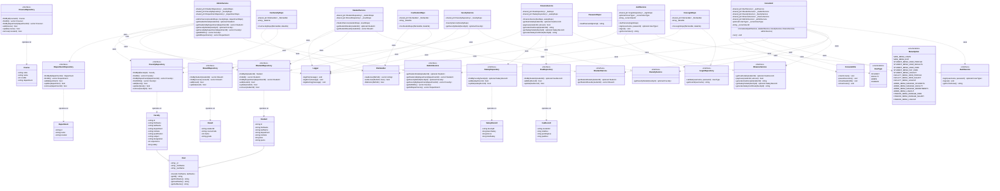

```mermaid
classDiagram
    %% Base Classes
    class User {
        -string _id
        -string _firstName
        -string _lastName
        +User(id, firstName, lastName)
        +getId() string
        +getFirstName() string
        +getLastName() string
        +getFullName() string
    }

    %% Entity Classes
    class Student {
        +string id
        +string firstName
        +string lastName
        +string department
        +string institute
        +long fees
        +string quota
    }

    class Faculty {
        +string id
        +string firstName
        +string lastName
        +string department
        +string institute
        +string qualification
        +string subject
        +string designation
        +int experience
        +long salary
    }

    class Department {
        +string id
        +string name
        +string location
    }

    class Course {
        +string code
        +string name
        +int credits
        +string department
    }

    class Result {
        +string studentId
        +string courseCode
        +int marks
        +string grade
    }

    class FeeRecord {
        +string studentId
        +long totalFee
        +long pendingFee
        +long paidFee
    }

    class SalaryRecord {
        +string facultyId
        +long basicSalary
        +long bonus
        +long totalSalary
    }
    
    %% Repository Interfaces
    class IStudentRepository {
        <<interface>>
        +findById(studentId) Student
        +findAll() vector~Student~
        +findByDepartment(departmentId) vector~Student~
        +add(student) bool
        +update(student) bool
        +remove(studentId) bool
    }

    class IFacultyRepository {
        <<interface>>
        +findById(facultyId) Faculty
        +findAll() vector~Faculty~
        +findByDepartment(departmentId) vector~Faculty~
        +findHODs() vector~Faculty~
        +add(faculty) bool
        +update(faculty) bool
        +remove(facultyId) bool
    }

    class IDepartmentRepository {
        <<interface>>
        +findById(departmentId) Department
        +findAll() vector~Department~
        +add(department) bool
        +update(department) bool
        +remove(departmentId) bool
    }

    class ICourseRepository {
        <<interface>>
        +findById(courseId) Course
        +findAll() vector~Course~
        +findByDepartment(departmentId) vector~Course~
        +add(course) bool
        +update(course) bool
        +remove(courseId) bool
    }

    class IResultRepository {
        <<interface>>
        +findByStudent(studentId) vector~Result~
        +findByCourse(courseId) vector~Result~
        +add(result) bool
        +update(result) bool
    }

    class IFeeRepository {
        <<interface>>
        +findByStudent(studentId) optional~FeeRecord~
        +add(feeRecord) bool
        +update(feeRecord) bool
    }

    class ISalaryRepository {
        <<interface>>
        +findByFaculty(facultyId) optional~SalaryRecord~
        +add(salaryRecord) bool
        +update(salaryRecord) bool
    }

    class ILoginRepository {
        <<interface>>
        +validate(username, password) UserType
        +getUserId(username) string
    }

    %% Service Interfaces
    class IAuthService {
        <<interface>>
        +login(username, password) optional~UserType~
        +logout() void
        +getCurrentUser() string
    }

    class IAdminService {
        <<interface>>
        +getStudentDetails(studentId) optional~Student~
        +getStudentsByDepartment(departmentId) vector~Student~
        +getFacultyDetails(facultyId) optional~Faculty~
        +getFacultyByDepartment(departmentId) vector~Faculty~
        +getAllHODs() vector~Faculty~
        +getAllDepartments() vector~Department~
    }

    class IStudentService {
        <<interface>>
        +getStudentDetails(studentId) optional~Student~
        +getStudentResults(studentId) vector~Result~
    }

    class IFacultyService {
        <<interface>>
        +getFacultyDetails(facultyId) optional~Faculty~
    }

    class IFinanceService {
        <<interface>>
        +getFeeDetails(studentId) optional~FeeRecord~
        +payFees(studentId, amount) bool
        +generateFeeReceipt(studentId) string
        +getSalaryDetails(facultyId) optional~SalaryRecord~
        +generateSalaryCertificate(facultyId) string
    }

    %% Service Implementations
    class AdminService {
        -shared_ptr~IStudentRepository~ _studentRepo
        -shared_ptr~IFacultyRepository~ _facultyRepo
        -shared_ptr~IDepartmentRepository~ _departmentRepo
        +AdminService(studentRepo, facultyRepo, departmentRepo)
        +getStudentDetails(studentId) optional~Student~
        +getStudentsByDepartment(departmentId) vector~Student~
        +getFacultyDetails(facultyId) optional~Faculty~
        +getFacultyByDepartment(departmentId) vector~Faculty~
        +getAllHODs() vector~Faculty~
        +getAllDepartments() vector~Department~
    }

    class StudentService {
        -shared_ptr~IStudentRepository~ _studentRepo
        -shared_ptr~IResultRepository~ _resultRepo
        +StudentService(studentRepo, resultRepo)
        +getStudentDetails(studentId) optional~Student~
        +getStudentResults(studentId) vector~Result~
    }

    class FacultyService {
        -shared_ptr~IFacultyRepository~ _facultyRepo
        +FacultyService(facultyRepo)
        +getFacultyDetails(facultyId) optional~Faculty~
    }

    class FinanceService {
        -shared_ptr~IFeeRepository~ _feeRepo
        -shared_ptr~ISalaryRepository~ _salaryRepo
        +FinanceService(feeRepo, salaryRepo)
        +getFeeDetails(studentId) optional~FeeRecord~
        +payFees(studentId, amount) bool
        +generateFeeReceipt(studentId) string
        +getSalaryDetails(facultyId) optional~SalaryRecord~
        +generateSalaryCertificate(facultyId) string
    }

    class AuthService {
        -shared_ptr~ILoginRepository~ _loginRepo
        -optional~UserType~ _currentUserType
        -string _currentUserId
        +AuthService(loginRepo)
        +login(username, password) optional~UserType~
        +logout() void
        +getCurrentUser() string
    }

    %% UI Classes
    class ConsoleUI {
        -shared_ptr~IAuthService~ _authService
        -shared_ptr~IStudentService~ _studentService
        -shared_ptr~IFacultyService~ _facultyService
        -shared_ptr~IFinanceService~ _financeService
        -shared_ptr~IAdminService~ _adminService
        -optional~UserType~ _currentUserType
        -string _currentUserId
        +ConsoleUI(authService, studentService, facultyService, financeService, adminService)
        +run() void
    }

    class MenuOption {
        <<enumeration>>
        MAIN_MENU_LOGIN
        MAIN_MENU_EXIT
        STUDENT_MENU_VIEW_PROFILE
        STUDENT_MENU_VIEW_RESULTS
        STUDENT_MENU_VIEW_FEES
        STUDENT_MENU_PAY_FEES
        STUDENT_MENU_LOGOUT
        FACULTY_MENU_VIEW_PROFILE
        FACULTY_MENU_VIEW_SALARY
        FACULTY_MENU_LOGOUT
        ADMIN_MENU_MANAGE_STUDENTS
        ADMIN_MENU_MANAGE_FACULTY
        ADMIN_MENU_MANAGE_DEPARTMENTS
        ADMIN_MENU_LOGOUT
        FINANCE_MENU_MANAGE_FEES
        FINANCE_MENU_MANAGE_SALARY
        FINANCE_MENU_LOGOUT
    }

    %% Utility Classes
    class ConsoleUtils {
        +clearScreen() void
        +pauseExecution() void
        +showHeader(title) void
        +showFooter() void
    }

    class FileHandler {
        +readLines(filePath) vector~string~
        +writeLines(filePath, lines) bool
        +fileExists(filePath) bool
    }

    class Logger {
        +logInfo(message) void
        +logError(message) void
        +logWarning(message) void
    }

    class PasswordInput {
        +readPassword(prompt) string
    }

    %% Enum
    class UserType {
        <<enumeration>>
        STUDENT
        FACULTY
        ADMIN
        FINANCE
    }

    %% Repository Implementation Classes
    class CsvStudentRepo {
        -shared_ptr~FileHandler~ _fileHandler
        -string _dataFile
        +CsvStudentRepo(fileHandler, dataFile)
    }

    class CsvFacultyRepo {
        -shared_ptr~FileHandler~ _fileHandler
        -string _dataFile
        +CsvFacultyRepo(fileHandler, dataFile)
    }

    class CsvLoginRepo {
        -shared_ptr~FileHandler~ _fileHandler
        -string _dataFile
        +CsvLoginRepo(fileHandler, dataFile)
    }

    %% Relationships and Inheritance
    Student --|> User
    Faculty --|> User
    
    %% Service Implementation to Interface
    AdminService ..|> IAdminService
    StudentService ..|> IStudentService
    FacultyService ..|> IFacultyService
    FinanceService ..|> IFinanceService
    AuthService ..|> IAuthService
    
    %% Repository Implementation to Interface
    CsvStudentRepo ..|> IStudentRepository
    CsvFacultyRepo ..|> IFacultyRepository
    CsvLoginRepo ..|> ILoginRepository
    
    %% UI to Service
    ConsoleUI ..> IAuthService: uses
    ConsoleUI ..> IStudentService: uses
    ConsoleUI ..> IFacultyService: uses
    ConsoleUI ..> IFinanceService: uses
    ConsoleUI ..> IAdminService: uses
    ConsoleUI ..> MenuOption: uses
    ConsoleUI ..> UserType: uses
    ConsoleUI ..> ConsoleUtils: uses
    
    %% Service to Repository
    AdminService ..> IStudentRepository: uses
    AdminService ..> IFacultyRepository: uses
    AdminService ..> IDepartmentRepository: uses
    StudentService ..> IStudentRepository: uses
    StudentService ..> IResultRepository: uses
    FacultyService ..> IFacultyRepository: uses
    FinanceService ..> IFeeRepository: uses
    FinanceService ..> ISalaryRepository: uses
    AuthService ..> ILoginRepository: uses
    
    %% Repository to Entity
    IStudentRepository ..> Student: operates on
    IFacultyRepository ..> Faculty: operates on
    IDepartmentRepository ..> Department: operates on
    ICourseRepository ..> Course: operates on
    IResultRepository ..> Result: operates on
    IFeeRepository ..> FeeRecord: operates on
    ISalaryRepository ..> SalaryRecord: operates on
    
    %% Repository to Utility
    CsvStudentRepo ..> FileHandler: uses
    CsvFacultyRepo ..> FileHandler: uses
    CsvLoginRepo ..> FileHandler: uses
    
    %% Service to Utility
    AdminService ..> Logger: uses
    StudentService ..> Logger: uses
    FacultyService ..> Logger: uses
    FinanceService ..> Logger: uses
    AuthService ..> Logger: uses
```